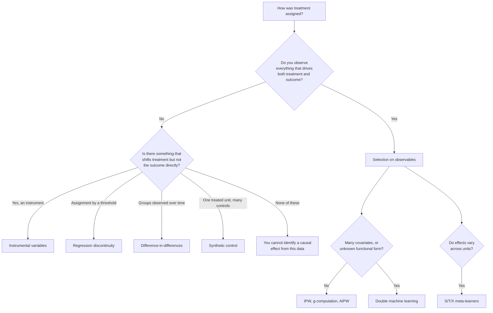

# Choosing an estimator

The choice is not "which method is best". It is "which assumption am I willing
to defend, given how treatment was assigned". Start from the assignment
mechanism and the estimator follows.

## Start here

Box `I` is a real destination. Some datasets do not support a causal claim, and
the professional answer is to say so rather than to run a regression anyway.

## Selection on observables

You believe treatment is as-good-as-random once you condition on measured
covariates. Everything here rests on that belief, which is untestable.

| Estimator | Models | Use when |
|---|---|---|
| [`difference_in_means`](api/estimators.md) | Nothing | A baseline to quantify how much confounding you are correcting |
| [`g_computation_ate`](api/estimators.md) | Outcome | The outcome is easier to model than treatment |
| [`ipw_ate`](api/estimators.md) | Treatment | Treatment assignment is easier to model than the outcome |
| [`aipw_ate`](api/estimators.md) | Both | Default choice — consistent if *either* model is right |
| [`double_machine_learning_ate`](api/dml.md) | Both, cross-fitted | Many covariates or non-linear nuisance functions |
| [`propensity_score_matching`](api/matching.md) | Treatment | You want an interpretable matched sample and a balance table |

Always run `difference_in_means` alongside your chosen estimator. If adjustment
barely moves the estimate, either there was little confounding or your
adjustment is not doing what you think.

!!! tip "AIPW is the sensible default"
    Doubly robust estimators are consistent if either the outcome model or the
    treatment model is correctly specified. You get two chances instead of one.
    That is not a licence to skip diagnostics — if overlap fails, both models
    are extrapolating and double robustness will not save you.

## When observables are not enough

| Design | Estimator | The assumption you are making |
|---|---|---|
| Instrument available | [`instrumental_variables_ate`](api/instrumental_variables.md) | The instrument affects the outcome *only* through treatment |
| Threshold assignment | [`local_linear_rdd`](api/rdd.md) | Units just above and just below the cutoff are comparable |
| Panel, treated and control groups | [`difference_in_differences`](api/difference_in_differences.md) | Trends would have been parallel without treatment |
| One treated unit, many controls | [`fit_synthetic_control`](api/synthetic_control.md) | A weighted mix of controls tracks the treated unit's counterfactual |

Each buys identification with a different untestable assumption, and each
estimates a different quantity. IV in particular estimates the **LATE** — the
effect among compliers — not the ATE. If compliers are unrepresentative, that
number does not generalise, and reporting it as "the" effect is a
misrepresentation.

## Heterogeneous effects

When the question is *for whom* rather than *on average*, use the meta-learners
in [`meta_learners`](api/meta_learners.md):

- **S-learner** — one model with treatment as a feature. Simplest; can shrink
  the effect toward zero when the model regularizes treatment away.
- **T-learner** — separate models per arm. Handles differing response surfaces;
  wasteful when one arm is small.
- **X-learner** — imputes individual effects then models them. Best when arms
  are badly imbalanced.

CATE estimates are noisier than ATE estimates, and the noise is easy to mistake
for signal. Validate against a known `true_ite` from
[`make_heterogeneous_treatment_data`](api/data_generators.md) before trusting a
targeting policy built on them.

## Before you believe any of it

Estimation is the middle of the workflow, not the end:

1. [Check overlap and balance](api/diagnostics.md) — an estimate computed where
   treated and control units do not overlap is extrapolation wearing a causal
   label.
2. [Quantify uncertainty](api/uncertainty.md) — `bootstrap_ate` wraps any
   compatible estimator.
3. [Test sensitivity](api/sensitivity.md) — how strong would an unmeasured
   confounder have to be to overturn the conclusion?
4. [Write it down](api/reporting.md) — `CausalReport` forces question, estimand,
   assumptions, diagnostics, uncertainty, limitations, and recommendation into
   one object.

The [assumptions matrix](assumptions.md) lists what each estimator requires and
how it fails when the requirement does not hold.
